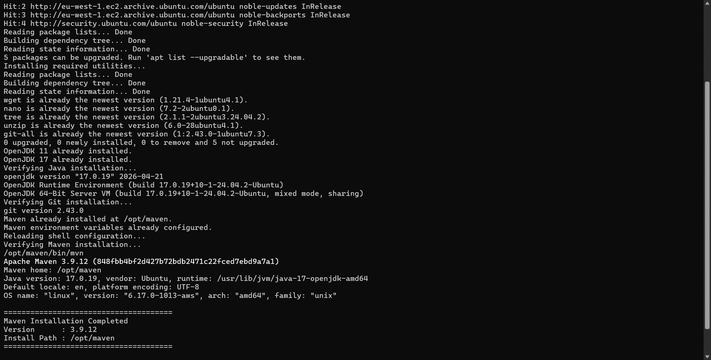
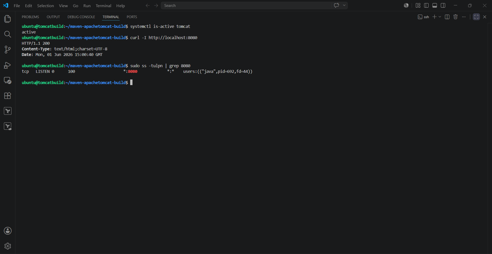
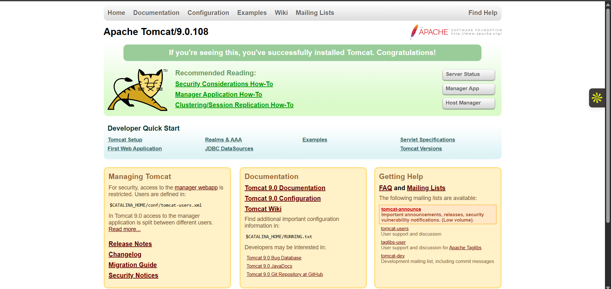
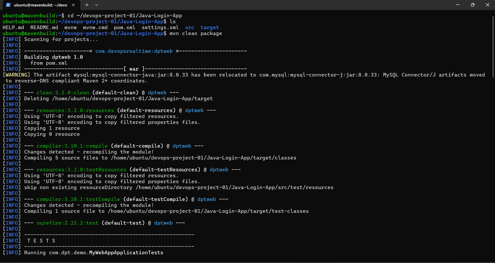
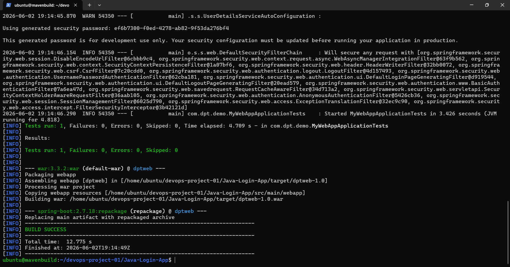
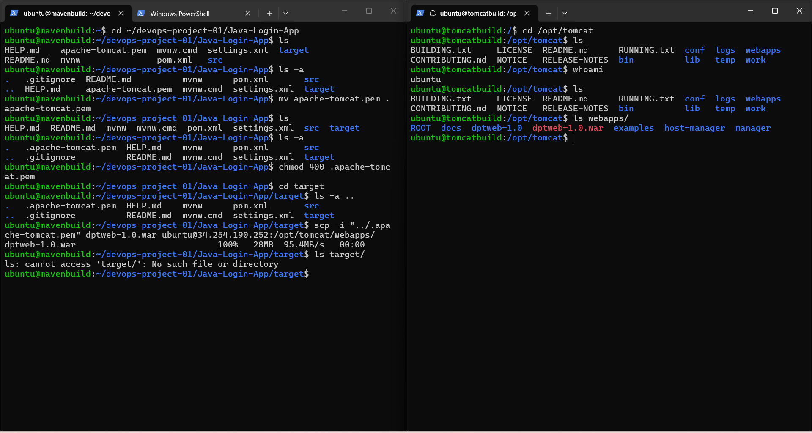
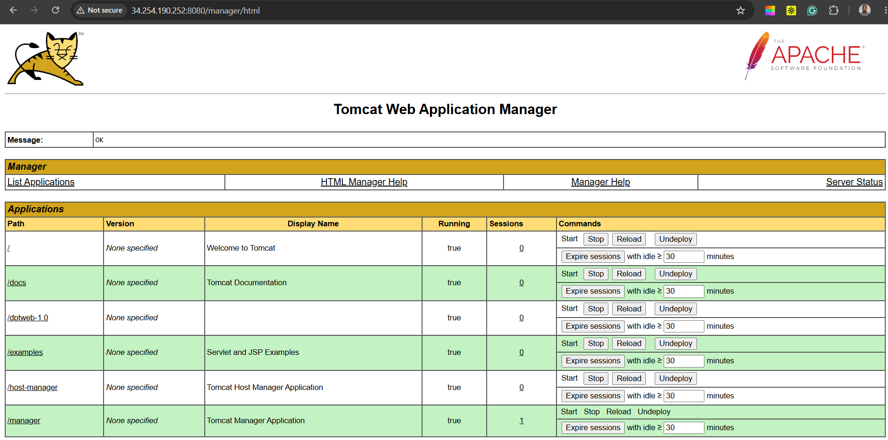
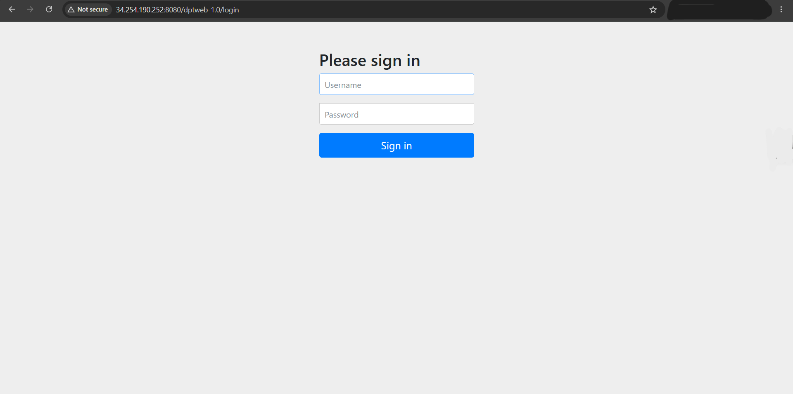

# Apache Maven & Apache Tomcat Provisioning Automation

## Overview

This project demonstrates the provisioning of a complete Java build and deployment environment on AWS using idempotent Bash automation.

The solution provisions:

* OpenJDK 11
* OpenJDK 17
* Apache Maven
* Apache Tomcat 9
* Common Linux administration utilities
* Environment variables required for Java tooling

The provisioned infrastructure was then used to build, package, transfer, and deploy a Java Spring Boot web application to Apache Tomcat.

The objective is to create a repeatable and consistent Java build and deployment environment that can be provisioned multiple times without causing configuration drift or duplicate installations.

---

## Project Structure

```text
maven-apachetomcat-build/
├── screenshots/
│   ├── 01-maven-build-start.png
│   ├── 02-maven-build-success.png
│   ├── 03-war-transfer-to-tomcat.png
│   ├── 04-tomcat-manager-deployment.png
│   ├── 05-java-login-page.png
│   ├── maven-validation.png
│   ├── tomcat-homepage.png
│   └── tomcat-service-validation.png
├── mavenbuild.sh
├── tomcatbuild.sh
└── README.md
```

---

## Components

### Apache Maven Build Server

The Maven provisioning script installs and configures:

* OpenJDK 11
* OpenJDK 17
* Apache Maven

Maven is installed into:

```text
/opt/maven
```

The script also configures:

```text
M2_HOME
PATH
```

allowing Maven commands to be executed from any directory.

---

### Apache Tomcat Application Server

The Tomcat provisioning script installs and configures:

* Apache Tomcat 9
* Required Java runtime
* Tomcat service configuration
* Tomcat startup and management commands

Tomcat is installed into:

```text
/opt/tomcat
```

and configured to run as a systemd service.

---

## What These Scripts Do

### Host Configuration

Configure the server hostname where required.

### Utility Installation

Install common administration and DevOps utilities:

```text
wget
nano
tree
unzip
git
```

### Java Installation

Install:

* OpenJDK 11
* OpenJDK 17

### Environment Configuration

Configure the required environment variables for Java-based tooling.

### Validation

Verify:

* Java installation
* Git installation
* Maven installation
* Tomcat installation

before completing execution.

---

## Idempotency

Both provisioning scripts are designed to be idempotent.

This means they can be executed multiple times without creating duplicate configurations or damaging an existing installation.

Examples:

* Hostname changes only occur when required.
* Java packages are checked before installation.
* Maven is only installed when it does not already exist.
* Tomcat is only installed when it does not already exist.
* Environment variables are only added when missing.
* Existing services are detected before recreation.

---

## Prerequisites

Before running the scripts, ensure you have:

* An AWS account
* An Ubuntu EC2 instance
* SSH access to the instance
* A user account with sudo privileges

Recommended instance size:

```text
t2.medium or larger
```

> During testing, a t3.micro instance experienced resource constraints while running Java-based services. A t2.medium or larger instance is recommended.

---

## Installation

Clone the repository:

```bash
git clone https://github.com/heyohjayy/java-build-deployment-provisioning.git
```

Move into the project directory:

```bash
cd maven-apachetomcat-build
```

---

## Operating System Compatibility

The provisioning scripts were developed and tested on Ubuntu Linux. The same workflow can be adapted for Amazon Linux, CentOS, and RHEL with minor package manager changes.

###

| Distribution      | Update Command       | Package Installation Command                                            |
| ----------------- | -------------------- | ----------------------------------------------------------------------- |
| Ubuntu / Debian   | `sudo apt update`    | `sudo apt install -y wget curl git unzip openjdk-11-jdk`                |
| Amazon Linux 2023 | `sudo dnf update -y` | `sudo dnf install -y wget curl git unzip java-11-amazon-corretto-devel` |
| CentOS / RHEL     | `sudo yum update -y` | `sudo yum install -y wget curl git unzip java-11-openjdk-devel`         |

### Additional Notes

* Maven installation steps remain the same across all supported distributions.
* Apache Tomcat installation and configuration steps remain the same across all supported distributions.
* Service management uses `systemctl` on Ubuntu, Amazon Linux 2023, CentOS 7+, and RHEL 7+.
* Firewall configuration commands may differ between distributions:

  * Ubuntu commonly uses `ufw`
  * CentOS and RHEL commonly use `firewalld`
  * Amazon Linux may use either `firewalld` or AWS Security Groups
* The Java application build process, WAR artifact generation, SCP transfer, Tomcat deployment, and application validation workflow remain unchanged.

---

## Apache Maven Provisioning

```bash
chmod +x mavenbuild.sh
./mavenbuild.sh
```

---

## Apache Tomcat Provisioning

```bash
chmod +x tomcatbuild.sh
./tomcatbuild.sh
```

---

## Verification

Verify Java:

```bash
java -version
```

Verify Maven:

```bash
mvn -version
```

Verify Tomcat:

```bash
systemctl status tomcat
```

Verify HTTP response:

```bash
curl -I http://localhost:8080
```

Expected Maven installation directory:

```text
/opt/maven
```

Expected Tomcat installation directory:

```text
/opt/tomcat
```

---

## Validation & Test Results

### Maven Idempotency Validation & Verification

The screenshot below shows a successful re-execution of the Maven provisioning script.



---

### Apache Tomcat Service Validation

Validation commands:

```bash
systemctl is-active tomcat
curl -I http://localhost:8080
sudo ss -tulpn | grep 8080
```



---

### Apache Tomcat Deployment Validation

The screenshot below shows Apache Tomcat successfully deployed and accessible through the EC2 instance.



---

## Java Application Build & Deployment

After provisioning the Maven Build Server and Apache Tomcat Application Server, the environment was used to build, package, transfer, and deploy a Java Spring Boot web application.

This demonstrates an end-to-end Java application delivery workflow using the provisioned infrastructure.

---

### Application Source Code & Build Process

To validate the provisioned infrastructure, a Java Spring Boot web application was used as the deployment target.

The application source code was maintained in a private Git repository and cloned onto the Maven Build Server for packaging and deployment. The same workflow can be applied to any Java Maven-based application repository.

Example application clone:

```bash
git clone https://github.com/<organisation>/<application-repository>.git
```

Navigate to the application directory:

```bash
cd <application-repository>
```

Build the application:

```bash
mvn clean package
```

The build process removes previous build artefacts, validates the project configuration, compiles the source code, executes automated tests, resolves required dependencies, and packages the application into a deployable WAR artefact for deployment to an Apache Tomcat server.






---

### WAR Artifact Generation

The Maven build process generated the following deployable WAR artifact:

```text
target/dptweb-1.0.war
```

---

### Secure Artifact Transfer

The generated WAR artifact was securely transferred from the Maven Build Server to the Apache Tomcat Server using SCP.

Example deployment command:

```bash
scp -i "<private-key>.pem" <application>.war <user>@<tomcat-server>:/opt/tomcat/webapps/
```

> Note: The private key filename, username, and server address will vary depending on your environment.



---

### Apache Tomcat Application Deployment

The WAR artifact was deployed to the Tomcat webapps directory where Tomcat automatically unpacked and deployed the application.

Tomcat Manager was configured to validate application deployment and runtime status.



---

### Application Validation

The deployed Java application was successfully accessed through a web browser using the Tomcat server.

Validation confirms:

* Application deployed successfully
* Application context loaded successfully
* Tomcat served requests correctly
* Login page rendered successfully
* End-to-end deployment completed successfully



---

## Summary

This project demonstrates the use of idempotent Bash scripting to automate the provisioning of a Java build and deployment environment on Ubuntu.

The solution provisions:

* OpenJDK 11
* OpenJDK 17
* Apache Maven
* Apache Tomcat 9

and demonstrates:

* Java application compilation
* Maven packaging
* WAR artifact generation
* Secure artifact transfer using SCP
* Apache Tomcat deployment
* Application validation through a web browser

The result is a repeatable Java build and deployment workflow suitable for learning, testing, infrastructure automation, and DevOps portfolio projects.

---

### 🚀 Final Note

These scripts were created to demonstrate practical Linux administration, Bash scripting, Java platform provisioning, service management, application deployment, and infrastructure automation techniques.

Feel free to use, modify, and extend them for your own environments and learning projects.

